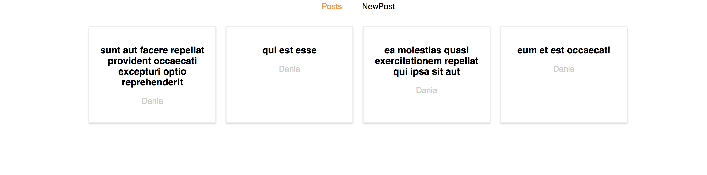
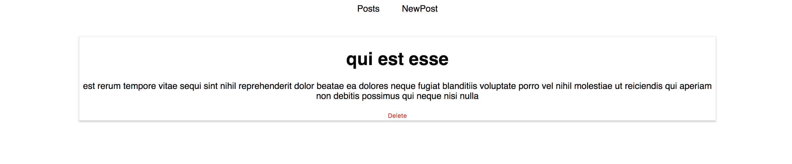
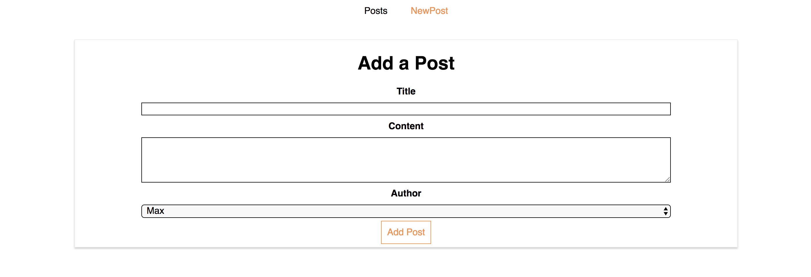

Reaching out to the Web (HTTP/AJAX Tutorial):

Using a blog post demo to learn about lifecycles, using axios to reach out to the server and routing.
Warning: This website does not have a back-end. It is a prototype for theory.

This website has all posts shown, shows individual post and can allow one to create a new post. 






Clone the repo
```
https://github.com/RedLeader12/BlogPostDemo-.git
```

Change the project folder directory
```
cd BlogPostDemo-
```

Npm install (for all the packages)
```
npm install
```

Give it a go. 
```
npm start
```